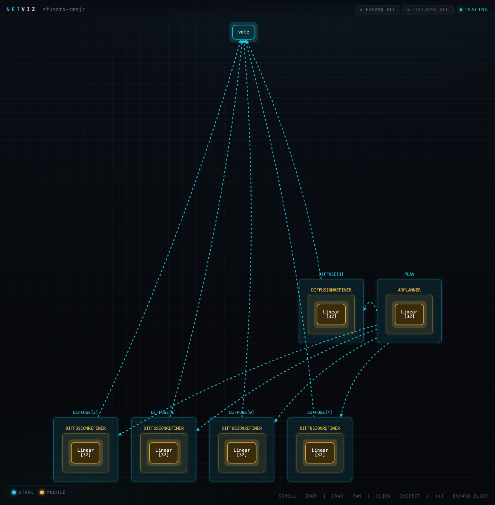
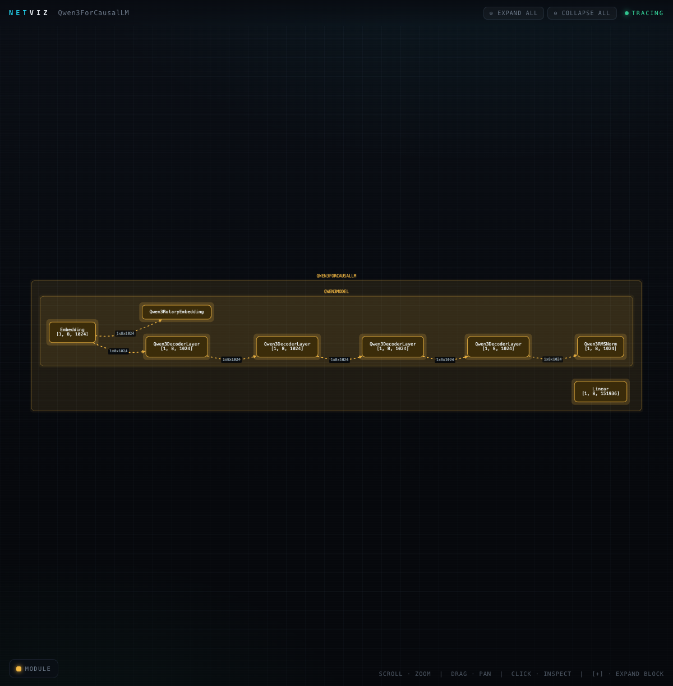
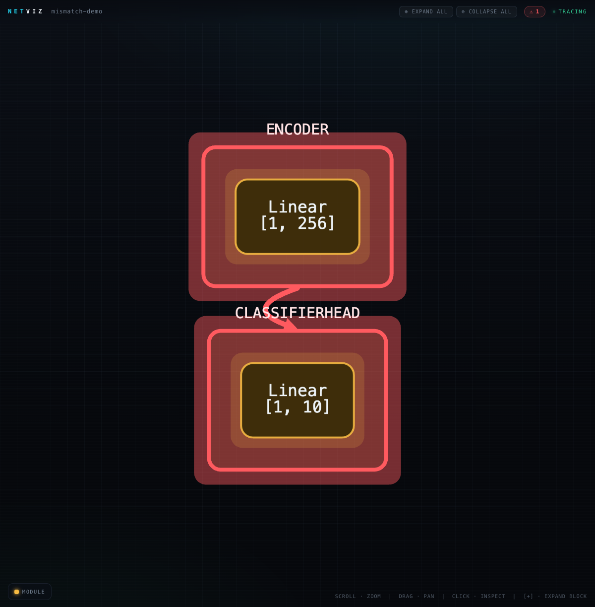

# netscope

**Trace, visualize, and sanity-check neural-network pipelines as you build them.**

`import netscope`, wrap a forward pass, and get an interactive graph of your
PyTorch / Hugging Face pipeline — real per-layer tensor shapes, the actual
dataflow, repeated blocks folded into one, and **shape mismatches flagged in
red** before they blow up at runtime. No decorators, ~zero overhead, no CDN.

> Working name. The hero demo is [sfumato](https://github.com/eren23/sfumato) —
> a hybrid AR (Qwen) + diffusion (LLaDA) reasoning pipeline.



---

## Why

When you build a model or wire a multi-stage pipeline, the *structure* and the
*tensor dataflow* are invisible while you type. Existing tools are **post-hoc**
(Netron / torchview need a built+exported model), **debug-time** (tensor value
viewers), or **web dashboards** (Langfuse / Phoenix — prompts & latency, no
architecture or shapes). None fuse **static source structure** with a **runtime
trace** and render it where you write code.

netscope captures the real run and turns it into a graph you can actually read.

## Quickstart

```python
import torch, torch.nn as nn
import netscope

model = nn.Sequential(nn.Linear(8, 16), nn.ReLU(), nn.Linear(16, 4))

with netscope.graph("mlp") as g:        # auto-traces everything inside
    model(torch.randn(2, 8))

g.show()                              # opens a self-contained interactive HTML
```

That's it — no decorators on your model, no edits. The forward pass is captured
via `wrapt` post-import hooks + torch's global module hooks (capture-once, so
steady-state overhead is ~zero), and only tensor *metadata* (shape/dtype/device)
is kept, never tensors.

## What you get

- **Real tensor shapes** on every node and dataflow edge, captured from the run.
- **Hierarchy** — `pipeline → stage → model → module` as nested boxes.
- **Dataflow edges** — within-model via tensor identity, cross-stage via light
  `nv.stage` / `nv.branch` / `nv.reduce` hints. Animated comet particles show
  tensors flowing.
- **Collapse/expand** — repeated blocks (a model's N decoder layers) fold into a
  single `[+]` node, so a deep model reads as a clean left-to-right pipeline.
- **Shape-mismatch warnings** — a dataflow edge whose producer/consumer shapes
  don't line up is painted red with a ⚠ list (feature-dim clashes *and*
  rank/"forgot to flatten()" bugs).
- **Static analysis** — `python -m netscope.static yourfile.py` recovers the
  branch/vote structure from source **without running it**.
- **Click-to-source** — every node carries `file:line`.

## Gallery

A real LLM architecture — **Qwen3** built from its Hub config (no weight
download), decoder layers folded:



A **shape mismatch** caught while wiring an encoder into a head:



Run them yourself:

```bash
python examples/sfumato_cmajc.py     # AR-plan -> diffuse x5 -> vote (CPU, mocked)
python examples/resnet_demo.py       # resnet18, 11.7M params, layers folded
python examples/transformer_demo.py  # a TransformerEncoderLayer
python examples/real_model_demo.py   # real Qwen3 arch, no weights (LAYERS=28 for all)
python examples/mismatch_demo.py     # Encoder(256) -> head(128): flagged red
```

## Optional hints

Auto-tracing sees *calls*, not *intent*. To name semantic regions (the stages,
the branches, the vote) add light markers — decorator or context-manager form,
both no-ops when not capturing:

```python
with netscope.stage("plan"):     plan = planner(x)
for b in range(5):
    with netscope.branch(f"diffuse[{b}]"):
        cand = refiner(plan)
with netscope.reduce("vote"):    winner = majority(cands)
```

## VSCode / Cursor extension

`extension/` is a TypeScript extension that renders the graph in the editor:
**Show Graph** (static skeleton, no run) and **Run & Trace** (real graph, fused
by source location), with click-a-node → jump-to-line. After a trace you also get
**inline shape hints** (each layer's real tensor shape as ghost text on its line),
**mismatch squiggles** (shape clashes underlined in red — even from the static
pass, before you run), and an **LLM assistant** on the node panel
(`explain` / `why flagged` / `suggest fix`, grounded in the real trace).

```bash
cd extension && npm install && npm run compile
# then press F5 in the extension/ folder ("Run netscope Extension"),
# set netscope.pythonPath to your venv, open a file, click the CodeLens.
```

Keyboard: **⌘⌥T** / **Ctrl+Alt+T** = Run & Trace, **⌘⌥G** / **Ctrl+Alt+G** = Show Graph.

### LLM assistant (optional)

The assistant talks to **any OpenAI-compatible endpoint** — OpenRouter by default
(→ many cheap models like Gemini Flash), or OpenAI / Together / Groq / a local
server. It's entirely optional: with no key, every other feature works offline.

- **In the editor:** run **`netscope: Set LLM API Key`** from the command palette.
  Your key is stored in the **OS keychain** (VSCode SecretStorage) — never in
  `settings.json`, never synced, never in git. Pick the model / endpoint via the
  `netscope.llm.model` and `netscope.llm.baseUrl` settings (these are not secret).
- **From the library / scripts:** set an env var instead —
  `OPENROUTER_API_KEY` (or `NETSCOPE_LLM_API_KEY` / `OPENAI_API_KEY`), with
  optional `NETSCOPE_LLM_MODEL` and `NETSCOPE_LLM_BASE_URL`. Then:
  ```python
  import netscope.llm as nl
  if nl.available():
      print(nl.explain(graph, node_id, question="why_warn"))
  ```

## MCP server — ground your coding agent in the real graph

netscope ships an **MCP server** so a coding agent (Cursor, Claude Code, …) can
query your model's *real* structure instead of guessing — "what actually flows
into `model.layers.2`?", "are there wiring mismatches in this file?". It's
stdlib-only (JSON-RPC over stdio, no extra deps) and needs no LLM key for the
first three tools.

Tools: **`trace_file`** (graph of a file — static, or a real run), **`query_node`**
(a node's real shapes / dtype / neighbours / mismatch), **`list_mismatches`**
(wiring clashes as structured data + source loc), **`explain_node`** (grounded
Q&A, if an LLM key is set).

Register the command `python -m netscope.mcp` with your agent. For example, in a
`.cursor/mcp.json` (or Claude Code's MCP config):

```json
{
  "mcpServers": {
    "netscope": { "command": "/path/to/.venv/bin/python", "args": ["-m", "netscope.mcp"] }
  }
}
```

See `examples/mcp_server_demo.py` for the tools driven in-process.

## Architecture

```
import netscope ─► wrapt post-import hooks patch torch + transformers
                 │  (gated by an active capture session; capture-once)
                 ▼
   contextvars parent-stack ──► typed IR over networkx.DiGraph
       {kind, parent, source, loc{file,line}, meta{shape,dtype,params}}
                 │
   ┌─────────────┼───────────────┬──────────────┬────────────────┐
   ▼             ▼               ▼              ▼                ▼
 dataflow    stage-flow      checks         sinks            static AST
 (tensor id) (hints)      (mismatches)  HTML/JSON/mermaid   producer
                 │                              │                │
                 └──────────── merge-by-loc ────┴────────────────┘
                                   │
              shared Cytoscape renderer (web/template.html)
              ── reused verbatim by the VSCode webview ──
```

Each layer is independently usable. The renderer libs are vendored and **inlined
into the generated HTML**, so a graph is one self-contained file — works offline
and inside locked-down webviews.

## Develop

```bash
python3 -m venv .venv --system-site-packages
.venv/bin/pip install -e ".[dev]"
.venv/bin/python -m pytest tests/          # 72 passed, 1 skipped (FLOPs: thop optional)
cd extension && npm run test:unit && npm run test:headless
```

Optional extras: `pip install -e ".[flops]"` (THOP per-layer FLOPs),
`".[otel]"` (OpenTelemetry export seam).
